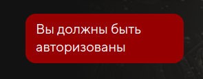
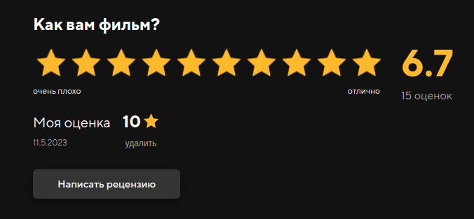
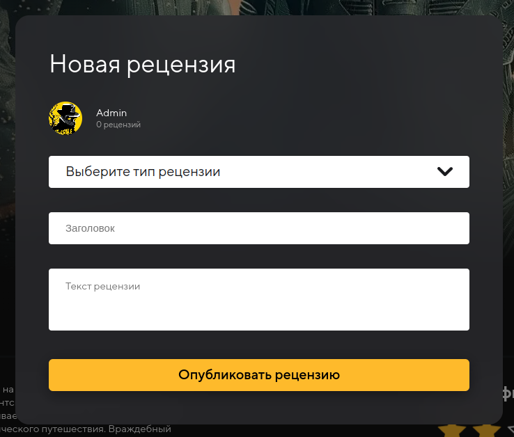
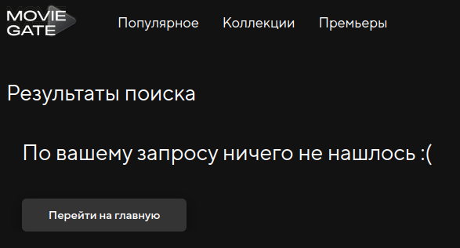

# Домашнее задание №3 по курсу "Обеспечение качества ПО" проекта VK Образование
## Команда: **BugOverload**

## Содержание

1. [Деплой](#деплой)
2. [Страница фильма](#задание)
3. [Ручное тестирование](#ручное-тестирование)

## Задание
Сделать чек-листы для будущих автотестов на проект 2-го семестра

## Деплой
[MovieGate](https://movie-gate.online/)

## Страница фильма
### Примеры доступны по ссылке:
[Страница фильма](https://movie-gate.online/film/1/)

## Кейсы
Для некоторых тестов потребуется авторизация. Можно например взять следующий аккаунт с логином Admin2@mail.com и паролем FPQ3823OveE1

Требуют авторизации:
* написание рецензии
* проставка/изменение/удаление оценки

### При нажатии на имя _режиссёра_ должен произойти переход на страницу персоны вида _movie-gate.online/person/:id/_
1. Перейти на страницу movie-gate.online/film/1
2. Найти режиссёра
3. Кликнуть по имени
4. Дождаться загрузки новой страницы с таймаутом 3 сек.
5. Проверить имя персоны на новой страницы с тем, по которому перешли

### Если пользователь неавторизован, то при попытке нажать на кнопку с "закладкой" или "+", должен появиться красный тостер с сообщением о необходимости авторизации
1. Перейти на страницу movie-gate.online/film/1
2. Найти кнопку "+"
3. Кликнуть по ней
4. Дождаться появления сообщения об ошибке "Вы должны быть авторизованы" с таумаутом 2 сек.

### При нажатии на кнопку с трейлером должно появиться модальное окно видео трейлера
1. Перейти на страницу movie-gate.online/film/1
2. Найти кнопку "Трейлер"
3. Кликнуть по ней
4. Дождаться появления модального окна с таумаутом 5 сек.

### Авторизованные пользователи могут поставить оценку от 1 до 10 включительно
1. Авторизоваться на сервисе
2. Перейти на страницу movie-gate.online/film/1
3. Найти кнопку (submit button) с value=8
4. Кликнуть по ней
5. Дождаться появления сообщения "Успех!" об успешности выполнения с таумаутом 2 сек.

### Пользователь может изменять оценку
1. Авторизоваться на сервисе
2. Перейти на страницу movie-gate.online/film/1
3. Найти кнопку (submit button) с value=8
4. Кликнуть по ней
5. Дождаться появления сообщения "Успех!" об успешности выполнения с таумаутом 2 сек.
6. Найти в блоке с инфо о поставленной оценке значение самой оценки.
8. Проверить, что значение равно "8"
9. Найти кнопку (submit button) с value=1
10. Кликнуть по ней
11. Дождаться появления сообщения "Успех!" об успешности выполнения с таумаутом 2 сек.
12. Найти в блоке с инфо о поставленной оценке значение самой оценки.
13. Проверить, что значение равно "1"

### Оценку можно удалить
1. Авторизоваться на сервисе
2. Перейти на страницу movie-gate.online/film/1
3. Найти кнопку (submit button) с value=8
4. Кликнуть по ней
5. Дождаться появления сообщения "Успех!" об успешности выполнения с таумаутом 2 сек.
6. Найти в блоке с инфо о поставленной оценке значение самой оценки.
7. Проверить, что значение равно "1"
8. Найти кнопку "Удалить"
9. Кликнуть по ней
10. Дождаться появления сообщения "Успех!" об успешности выполнения с таумаутом 2 сек.
11. Проверить, что нет блока о поставленной оценке

### При наличии авторизации и нажатии на кнопку "Написать рецензию" появляется модальное окно рецензии
1. Авторизоваться на сервисе
2. Перейти на страницу movie-gate.online/film/1
3. Найти кнопку "Написать рецензию"
4. Кликнуть по ней
5. Дождаться появления модального окна с таймаутом 3 сек.

### При неавторизации при попытке нажать на кнопку "Написать рецензию" или попытаться поставить оценку, появится тостер с сообщением о необходимости авторизации
1. Перейти на страницу movie-gate.online/film/1
2. Найти кнопку "Написать рецензию"
3. Кликнуть по ней
4. Дождаться появления сообщения об ошибке "Вы должны быть авторизованы" с таумаутом 2 сек.

### При попытке отправить рецензию с незаполненными полями, модальное окно не закроется
1. Авторизоваться на сервисе
2. Перейти на страницу movie-gate.online/film/1
3. Найти кнопку "Написать рецензию"
4. Кликнуть по ней
5. Дождаться появления модального окна с таймаутом 3 сек.
6. Заполнить текстовое поле заголовка значением "Заголовок"
7. Заполнить текстовое поле основоного текста значением "Рецензия"
8. Найти в модалке кнопку "Опубликовать рецензию"
9. Кликнуть по ней
10. С задержкой 1 сек проверить, что всё ещё можно найти кнопку "Опубликовать рецензию".

### После публикации рецензия будет отображена сверху в области с рецензиями
1. Авторизоваться на сервисе
2. Перейти на страницу movie-gate.online/film/1
3. Найти кнопку "Написать рецензию"
4. Кликнуть по ней
5. Дождаться появления модального окна с таймаутом 3 сек.
6. Заполнить текстовое поле заголовка значением "Заголовок"
7. Заполнить текстовое поле основоного текста значением "Рецензия"
8. Установить значение типа рецензии как "Положительная"
8. Найти в модалке кнопку "Опубликовать рецензию"
9. Кликнуть по ней
10. Дождаться появления сообщения "Успех!" об успехе с таумаутом 2 сек.
11. В списке рецензий взять первый элемент
12. Сравнить значения заговка и текста рецензии на равенство.

## Поиск
### Примеры доступны по ссылке:
[Результат поиска](https://movie-gate.online/search/q-%D0%B0)
### При вводе запроса и нажатии Enter происходит переход на страницу вида movie-gate.online/search/q-:text
1. Перейти на страницу movie-gate.online
2. Найти кнопку текстовое поле "Поиск"
3. Ввести значение "abc"
4. Нажать клавишу Enter
5. Дождаться перехода на страницу https://movie-gate.online/search/q-abc/ с таумаутом 5 сек.
6. Найти в результатах поиска заголовок "Результаты поиска"

### Результаты поиска группируются по категориям: фильмы - "Найденные фильмы", сериалы - "Найденные сериалы", персоны - "Найденные имена"
1. Перейти на страницу movie-gate.online
2. Найти кнопку текстовое поле "Поиск"
3. Ввести значение "a"
4. Нажать клавишу Enter
5. Дождаться перехода на страницу https://movie-gate.online/search/q-a/ с таумаутом 5 сек.
6. Найти в результатах поиска заголовок категорий "Найденные фильмы", "Найденные сериалы", "Найденные персоны"

### При нажатии на картинку любой найденной сущности проиходит переход на соответствующую страницу
1. Перейти на страницу movie-gate.online
2. Найти кнопку текстовое поле "Поиск"
3. Ввести значение "a"
4. Нажать клавишу Enter
5. Дождаться перехода на страницу https://movie-gate.online/search/q-a/ с таумаутом 5 сек.
6. Найти картинку сериала "Черное зеркало"
7. Кликнуть по ней
8. Дождаться перехода на страницу сериала с таумаутом 5 сек.
9. Найти на странице название и сравнить со значением "Черное зеркало"

### В случае полного отсутствия результатов будет выведено сообщение: "По вашему запросу ничего не нашлось :(".
1. Перейти на страницу movie-gate.online
2. Найти кнопку текстовое поле "Поиск"
3. Ввести значение "qwerty"
4. Нажать клавишу Enter
5. Дождаться перехода на страницу https://movie-gate.online/search/q-qwerty/ с таумаутом 5 сек.
6. Проверить наличие надписи "По вашему запросу ничего не нашлось :("

### В случае полного отсутствия результатов будет выведено сообщение: "По вашему запросу ничего не нашлось :(". Ниже будет отображена кнопка "Перейти на главную". На нажатии на кнопку происходит переход на главную страницу (https://movie-gate.online/)
1. Перейти на страницу movie-gate.online
2. Найти кнопку текстовое поле "Поиск"
3. Ввести значение "qwerty"
4. Нажать клавишу Enter
5. Дождаться перехода на страницу https://movie-gate.online/search/q-qwerty/ с таумаутом 5 сек.
6. Найти кнопку "Перейти на главную"
7. Кликнуть по ней.
8. Дождаться перехода на страницу movie-gate.online с таумаутом 5 сек.
9. Найти на главной кнопку "Перейти", чтобы проверить, что мы действительно на главной.